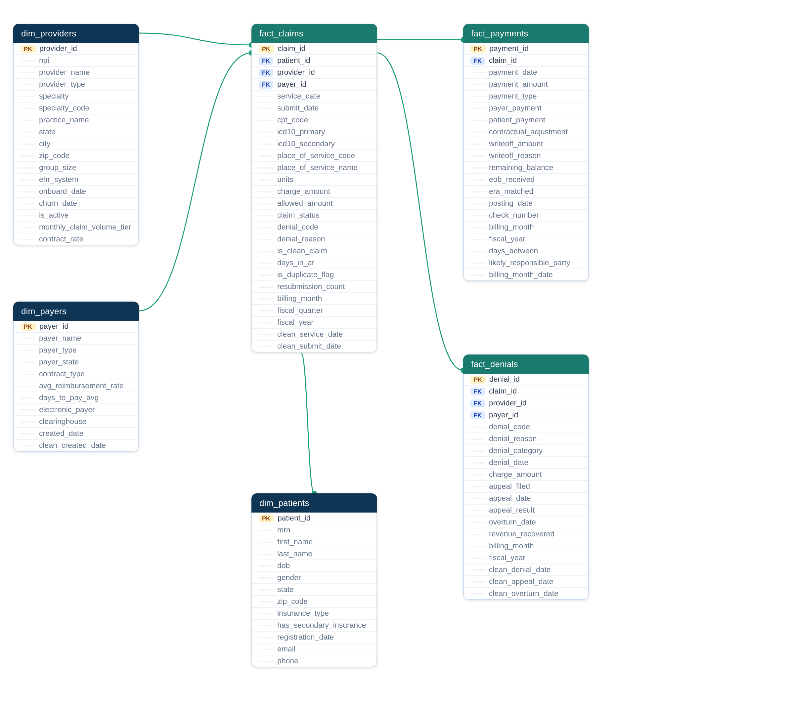
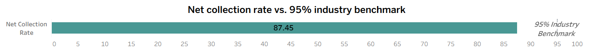
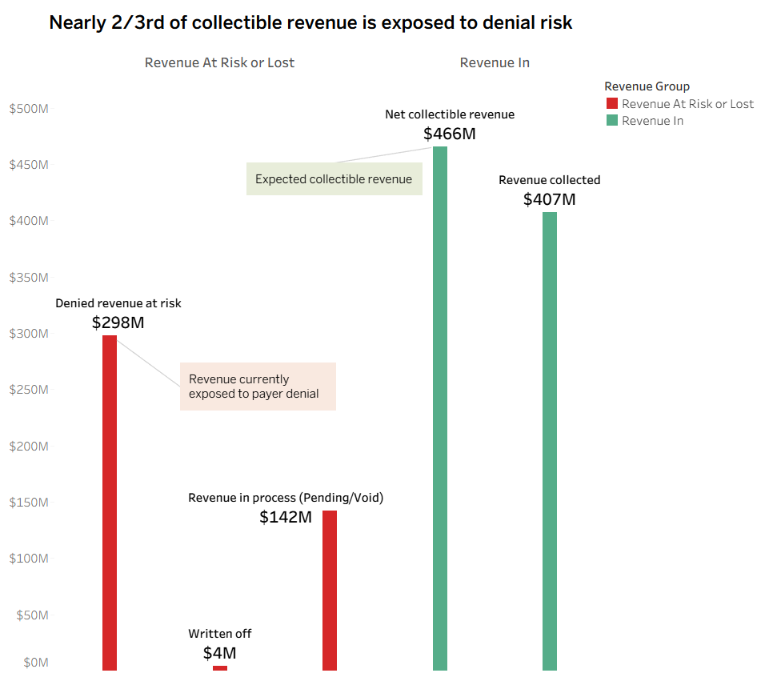
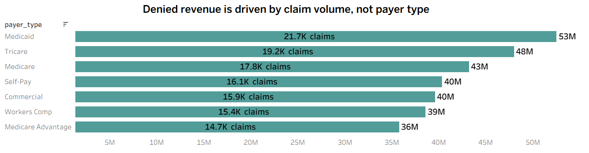
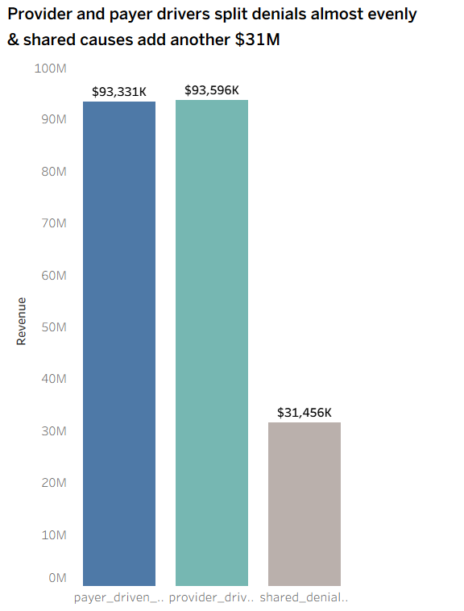
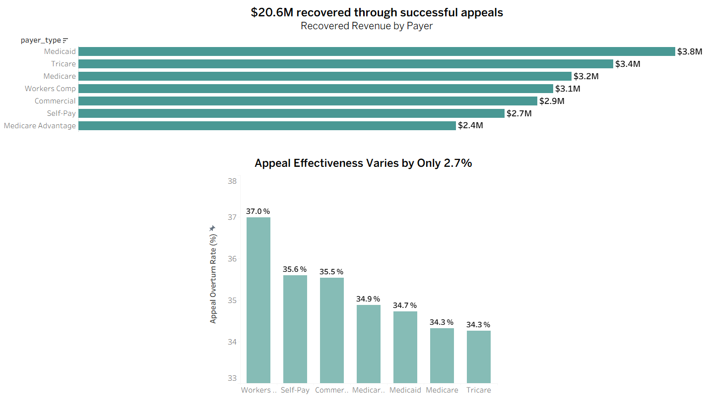
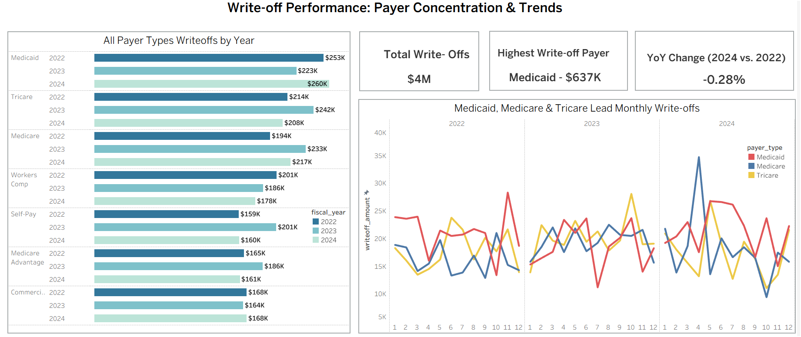
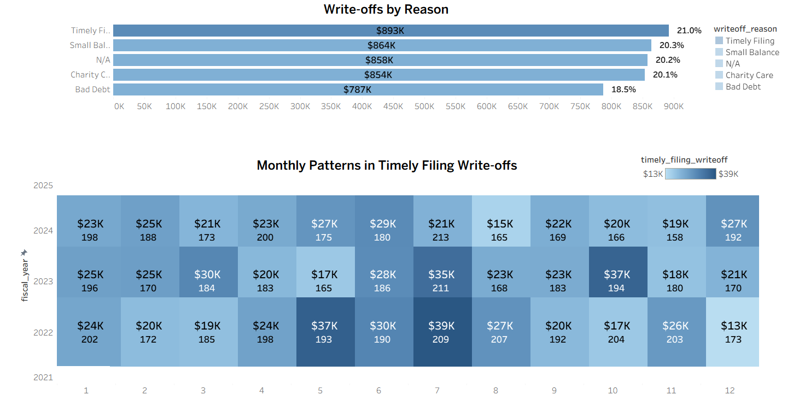
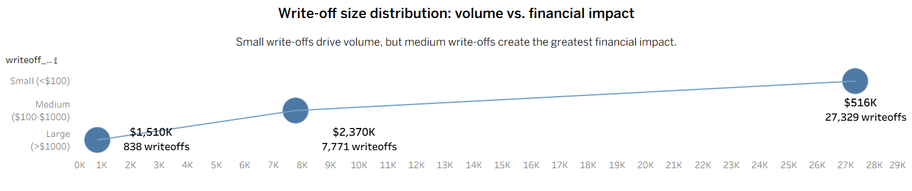

# ClearAxis Health (RCM) Revenue Cycle Management Analytics 

  

## Table of Contents

| |
|---|
| **[Background & Overview](#background--overview)** |
| &nbsp;&nbsp;Company Context |
| &nbsp;&nbsp;Project Goals |
| &nbsp;&nbsp;Business Areas & Stakeholder Alignment |
| **[Initial Business Questions & Data Structure](#initial-business-questions--data-structure)** |
| &nbsp;&nbsp;North Star Metrics |
| &nbsp;&nbsp;Dataset Overview |
| &nbsp;&nbsp;Entity Relationship Diagram |
| &nbsp;&nbsp;Table Descriptions |
| **[Executive Summary](#executive-summary)** |
| **[Insights Deep Dive](#insights-deep-dive)** |
| &nbsp;&nbsp;**[Executive Performance](#executive-performance)** |
| &nbsp;&nbsp;&nbsp;&nbsp;Net Collection Rate |
| &nbsp;&nbsp;&nbsp;&nbsp;Revenue Disposition Overview |
| &nbsp;&nbsp;**[Payer & Denial Performance](#payer--denial-performance)** |
| &nbsp;&nbsp;&nbsp;&nbsp;Denied Revenue by Payer Type |
| &nbsp;&nbsp;&nbsp;&nbsp;Denial Accountability Analysis |
| &nbsp;&nbsp;&nbsp;&nbsp;Appeal Effectiveness & Revenue Recovery |
| &nbsp;&nbsp;**[Write-Off Analysis & Revenue Impact](#write-off-analysis--revenue-impact)** |
| &nbsp;&nbsp;&nbsp;&nbsp;Write-Off Trends by Payer Type |
| &nbsp;&nbsp;&nbsp;&nbsp;Write-Off Drivers by Reason |
| &nbsp;&nbsp;&nbsp;&nbsp;Write-Off Distribution by Amount |
| **[Recommendations](#recommendations)** |
| **[Technical Details](#technical-details)** |
| **[Clarifying Questions, Assumptions & Caveats](#clarifying-questions-assumptions--caveats)** |

---
<h2 align="center">Background & Overview</h2>

### Company Context

ClearAxis Health is a Revenue Cycle Management (RCM) SaaS platform serving healthcare providers across 15 states. ClearAxis operates as the billing and claims management backbone for physicians, hospitals, clinics, and surgery centers, enabling providers to submit, track, and collect on insurance claims across 150 payer organizations, including Commercial, Medicare, Medicaid, Medicare Advantage, Tricare, Self-Pay, and Workers Compensation.

### Project Goals

As the data analyst embedded with the ClearAxis Finance and Revenue Cycle Operations teams, this analysis was commissioned to answer a single overarching business question:

> **Is ClearAxis Health collecting revenue as efficiently as it should be, and where are the primary sources of revenue loss, delay, and collection risk?**

To answer this, the analysis pursues four specific objectives:

1. **Evaluate collection performance** against the 95% target benchmark for Net Collection Rate.
2. **Identify the primary drivers** of the collection gap, denial patterns, and write-off behavior.
3. **Assess accountability** between provider-side, payer-side, and shared denial causes.
4. **Prioritize actionable recommendations** that Revenue Cycle, Finance, and Operations leadership can act on immediately.
### Business Areas & Stakeholder Alignment

| Area | Key Metric | Primary Stakeholder |
|---|---|---|
| Collection Efficiency | **87.45%** vs. **95% benchmark** | CFO, Finance Director |
| Denial Management | **$298M denied revenue** across **120,735 claims** | Revenue Cycle Operations, Coding & Billing |
| Appeal Performance | **$20.6M recovered revenue** | Appeals Team, Revenue Cycle Director |
| Write-Off Analysis | **$4.26M total write-offs** | Finance, AR Manager, Revenue Cycle Operations |
| Write-Off Optimization | **$2.37M medium balance claims** across **7,771 transactions** | AR Management, Finance |
---
<h2 align="center">Initial Business Questions & Data Structure</h2>

### North Star Metrics

Is the collection efficient?  - **Net Collection Rate**

Where is revenue at risk?  - **Denied Revenue at Risk**

What revenue is permanently lost?  - **Total Write-Off Amount** 

### Dataset Overview

The dataset covers **36 months (January 2022–December 2024)** and contains **6 relational tables structured as a star schema**, supporting analysis across claims, payments, denials, providers, payers, and patients.

### Entity Relationship Diagram

  

### Table Descriptions

**`fact_claims` - 500,000 rows** Core claim-level transaction table containing charges, status, denial codes, clean claim flags, and Days in AR.

**`fact_payments` - 300,000 rows** Payment-level transaction table containing collections, write-offs, contractual adjustments, and payment dates.

**`fact_denials` - 124,685 rows** Denial-level table containing denial codes, categories, appeal outcomes, and recovered revenue.

**`dim_providers` - 2,000 rows** Provider dimension containing specialty, EHR system, state, group size, and contract information.

**`dim_payers` - 150 rows** Payer dimension containing payer type, contract type, reimbursement rate, and clearinghouse information.

**`dim_patients` - 50,000 rows** Patient dimension containing insurance type, state, and secondary coverage information.

---
<h2 align="center">Executive Summary</h2>

- ClearAxis Health collected **87.45% of net collectible revenue** against a 95% industry benchmark, leaving approximately $58.4M unrealized over the 36-month period.
- The primary driver is **$298M** in denied and appealed claims **across 120,735 claims**, a problem distributed uniformly across all seven payer types at identical 24–25% denial rates, pointing to a systemic failure in billing operations rather than any single payer relationship.
- Accountability for this denial exposure is split nearly equally between **provider-driven** coding and authorization errors **(42%, $93.6M)** and **payer-side** determination policies **(42%, $93.3M)**, meaning neither side alone can solve it.
- The **appeals** process currently recovers **$20.6M at a 34–37%** overturn rate, which is effective, but likely covers only a fraction of the eligible denied claims. Separately, **$4.26M** has been **permanently written off**, concentrated in medium-sized balances ($100–$1,000), where follow-up on collections is most worthwhile.

---
<h2 align="center">Insights Deep Dive</h2>

## Executive Performance

### Net Collection Rate

  

- ClearAxis collected **$407.4M against $465.8M** in net collectible revenue. 
- An 87.45% Net Collection Rate that sits **7.55 percentage points below** the 95% industry benchmark.
- Translated to dollars, this gap represents approximately **$58.4M** in revenue that was contractually collectible but never reached the books. This performance shortfall is what prompted the deeper investigation into denial patterns and write-off behavior documented below.

### Revenue Disposition Overview

  

- The **$298M in denied revenue** and **$142M in pending/void claims** are measured at charge amount, the provider's list price before payer adjustments, while the **$407M collected** and **$4.26M written off** reflect actual transacted values.
- These figures should not be summed cause they represent different stages of the same revenue lifecycle, not additive components of a single total. 
- The **denied revenue exposure is the priority** because, unlike write-offs, it is not yet permanently lost.

## Payer & Denial Performance

### Denied Revenue by Payer Type

  

- The average charge per denied claim is nearly identical across all seven payers, ranging from **$2,422 to $2,512**, and all deny at the same rate, **24 to 25%**. 
- This means Medicaid's $53M in denied revenue is not due to Medicaid being a harder payer to work with. It is because Medicaid has the most claims.
- The implication is counterintuitive that there is no payer relationship to fix. The same denial rate, hitting a larger claim volume, produces more denied dollars. The **problem lies in the submission process and affects every payer equally**.

### Denial Accountability Analysis

  

- The **42/42/16** split is the most operationally significant finding in this analysis. This indicates that **roughly half of the $298M problem is entirely within ClearAxis's control**, including billing errors, missed prior authorizations, and late submissions made by the billing team before the claim ever reached the payer. 
- The other half requires working directly with the payer to challenge coverage decisions, fix patient eligibility gaps, and resolve dual-insurance disputes.
- A team that focuses only on internal billing improvements will address half the problem. A team that focuses only on payer negotiations addresses the other half. Neither approach alone can move the $298M figure. **Both tracks must run simultaneously**.

### Appeal Effectiveness & Revenue Recovery

  

- **1/3 denied claims** that reach appeal **are successfully overturned**, and that ratio holds regardless of which payer originally denied the claim.
- **Workers Comp reverses 37%** of appeals, **Tricare reverses 34.3%**, and every other payer falls within that narrow band. The $20.6M recovered through appeals is meaningful, but it likely represents only a fraction of what is recoverable. 
- The data does not show how many eligible denied claims were never appealed. Hence, the most valuable action is not optimizing which payer to appeal against; it is **ensuring that every claim that qualifies for appeal actually gets one filed**.

## Write-Off Analysis & Revenue Impact

### Write-Off Trends by Payer Type

  

- **Write-offs total $4.26M** across the three-year window, distributed across all seven payer types with no single payer dominating.
- At the aggregate level, write-offs are essentially flat, **changing by only -0.28% from 2022 to 2024**. This means that payer-level movements are offsetting each other. Improvements in some payers are being masked by increases in others. Ex. Workers Comp and Tricare write-offs declined meaningfully while Medicaid and Medicare write-offs increased.
- Provider group size is not a factor. Write-off rates range from **0.56% to 0.62% across Solo through 50+ practices**, confirming this is a billing process problem, not a capacity or resource problem (insufficient staff, time, or equipment to see more patients or handle work efficiently).

### Write-Off Drivers by Reason

  

- All five write-off categories fall within a tight band between **$787K and $893K**, close enough that no single reason dominates. **Timely Filing** ranks at the **top at $893K (21%)**, which matters because it is the only category that is entirely preventable.
- Timely filing write-offs **declined 9.9% from 2022 to 2024** **($302K to $272K)**, showing the problem is improving, but slowly.  
- The monthly heatmap shows no recurring peak month across any of the three years, confirming that this is not a seasonal surge; it is a chronic submission discipline problem that occurs at roughly the same rate every month.

### Write-Off Distribution by Amount

  

- Small write-offs under **$100 account for 27,329 transactions** but generate only **$516K** in total, an average of $19 each. Chasing these individually costs more in staff time than the balance is worth. 
- Medium write-offs between **$100 and $1,000** are the priority, **7,771 transactions totaling $2.37M**, averaging $305 each, enough to justify follow-up, manageable enough in volume to run systematically.
- Large write-offs above **$1,000** are rare **(838 transactions)** but individually costly, averaging $1,801 each and totaling **$1.51M**. These warrant dedicated case-by-case account management. The strategic prescription is three-tiered: automate small, systemize medium, escalate large.

---

<h2 align="center">Recommendations</h2>

| Priority | Action | Team | Success Metric |
|---|---|---|---|
| **P0** | **Implement 30-day submission monitoring** to flag claims approaching payer timely filing deadlines. | Billing Operations | Timely filing write-off amount |
| **P0** | **Launch a systematic appeal program** for eligible denied claims, prioritizing provider-driven denial codes. | Revenue Cycle · Appeals | Appeal filing rate · Overturn rate |
| **P0** | Run a **dual-track denial reduction initiative** addressing internal billing errors and payer-side disputes. | Coding · Billing · Payer Contracting | Net Collection Rate · Denial rate by accountability |
| **P1** | Establish a **dedicated workflow for $100–$1,000 balances** before write-off decisions are made. | AR Management | Medium write-off amount · Recovery rate |
| **P1** | **Automate handling of balances below $100** to reduce low-value collection effort. | AR Management · Finance | Staff hours per dollar recovered |
| **P2** | **Investigate the $858K classified as “Unknown”** and strengthen write-off reason documentation. | Revenue Cycle · Compliance | Unknown write-off % of total |

---
<h2 align="center">Technical Details</h2>

### Project Files
> **Explore the project:**
[View SQL Cleaning](https://github.com/abeerfatima3003/ClearAxis_Health-Revenue_Cycle_Management_Analytics/tree/main/data_cleaning), [View SQL Analysis](https://github.com/abeerfatima3003/ClearAxis_Health-Revenue_Cycle_Management_Analytics/tree/main/data_analysis), [View Tableau Visualizations](https://github.com/abeerfatima3003/ClearAxis_Health-Revenue_Cycle_Management_Analytics/tree/main/tableau)

### Tools & Technologies

- **Database:** Microsoft SQL Server 2022 Express - data loading, cleaning, transformation, and analysis
- **Visualization:** Tableau Public - analytical dashboards and visualizations
- **Version Control:** GitHub - SQL scripts, documentation, and project files

---
<h2 align="center">Clarifying Questions, Assumptions & Caveats</h2>

### Data Quality & Methodology

- **Date inconsistencies:** Service, submission, and payment dates contained multiple formats and incorrect year entries. Clean DATE fields were created and invalid records flagged during transformation.

- **Duplicate claim IDs:** Approximately 2% of claim IDs contained formatting variants such as lowercase or hyphenated values. IDs were standardized, and duplicate records were excluded from analysis.

- **Appeal date anomalies:** 49,072 denial records contained inconsistent date sequences. The analysis retains valid denial-to-appeal sequences to avoid the systematic exclusion of successful appeals.

- **Missing and inconsistent fields:** Missing place-of-service names, inconsistent gender values, and NULL denial codes were standardized using deterministic transformation rules.

### Assumptions & Stakeholder Questions

- **Net collectible revenue:** Defined as charge amount less contractual adjustments from `fact_payments`, representing revenue considered realistically collectible.

- **Denied revenue at risk:** Includes both Denied and Appealed claims measured at `charge_amount`, since `allowed_amount` may be unavailable for claims that were never adjudicated.

- **Write-off classification:** The $858K “Unknown” category requires stakeholder clarification to determine whether the issue reflects missing documentation, inconsistent workflows, or a data capture gap.

- **Operational validation:** Stakeholders should confirm whether the decline in timely filing write-offs reflects a specific operational initiative and whether post-churn claims represent legitimate late submissions or a data pipeline issue.

